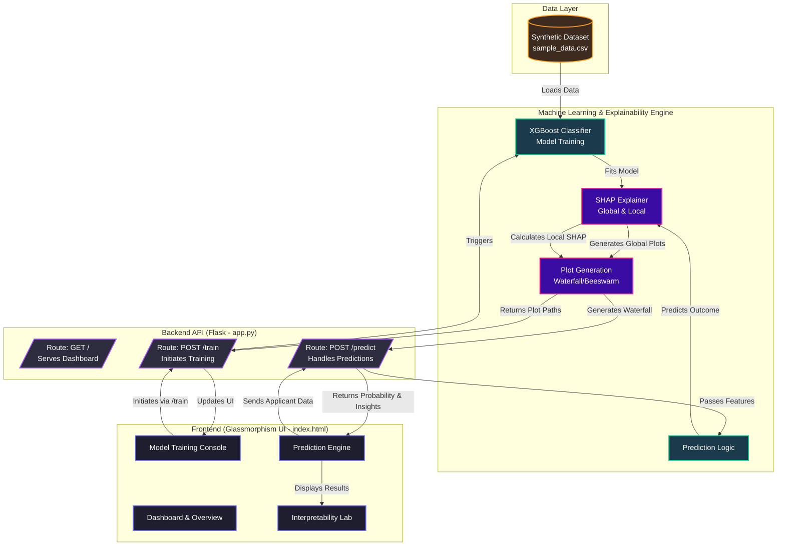

# Interpretable AI Framework Architecture

Since the image generation service is currently unavailable, I have created a detailed **Mermaid Architecture Diagram** for your project. This is standard for technical documentation, and ChatGPT can easily understand and describe it as well. 

You can preview the diagram directly below:



### How to use this for your report:
1. **In ChatGPT:** If you copy and paste this entire markdown block (including the code section starting with ` ```mermaid `), ChatGPT will understand the exact structure and can write a rich textual description of the architecture.
2. **In your actual report:** You can use tools like [Mermaid Live Editor](https://mermaid.live/) to paste the code above, which will instantly generate a high-quality, downloadable PNG/SVG image of your system architecture!
